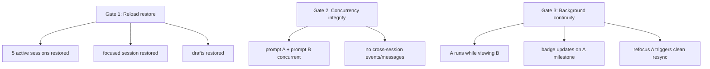

# Detailed Design: rho-web Mobile-First Multi-Session Chat (POC)

## Overview

This design adds **parallel session execution** to rho-web from a **single browser tab**, optimized for mobile reliability.

Today, backend infrastructure already supports multiple RPC sessions, but the frontend is modeled as one global active session. The POC refactors frontend state and routing to support multiple active sessions concurrently while keeping UI/behavior intentionally simple (KISS).

### Design goals

- Run multiple sessions in parallel from one tab.
- Keep mobile UX simple: **session list → focused chat**.
- Preserve existing rich rendering for the focused chat.
- Keep background sessions lightweight (status + milestone badges only).
- Restore active sessions/focus/drafts after reload.
- Validate with **5 simultaneously active sessions**.

### Explicit v1 exclusions

- Split-screen simultaneous multi-chat rendering
- Cross-session global queue UX
- Desktop/toast notifications for background milestones
- Explicit process controls (close/deactivate/stop buttons)

---

## Detailed Requirements

Consolidated from idea-honing:

1. Background sessions continue running while unfocused.
2. Unfocused sessions do **not** live-render streaming deltas; only lightweight status updates.
3. On refocus, session resync is required (`/api/sessions/:id` + RPC `get_state`).
4. No enforced concurrent session cap in v1.
5. Tapping a historical session auto-starts RPC and opens it as live chat.
6. Unread markers are milestone-only (`agent_end`, errors).
7. Badges only; no milestone toast notifications.
8. Reload should restore active sessions automatically.
9. No explicit close/deactivate controls in v1.
10. Session list ordering: streaming first, then active non-streaming by recency, then inactive history.
11. Concurrent prompts across sessions are allowed.
12. Backend API additions are allowed if needed.
13. Restore scope includes active session IDs, focused session ID, and per-session draft text.
14. On restore failure for one session, continue restoring others and surface lightweight per-session error state.
15. Rock-solid POC pass/fail checks:
    - Reload restore works (target 5 active sessions)
    - Concurrent streams have no cross-talk
    - Background continuity + correct refocus resync

---

## Architecture Overview

```mermaid
flowchart LR
    U[Browser UI\nSingle tab] --> WS[/ws WebSocket]
    U --> API[/api/sessions* REST]

    WS --> HUB[WS Router\nserver-rpc-ws-routes.ts]
    HUB --> SUBS[Per-WS session subscriptions\nMap<sessionId, unsubscribe>]

    SUBS --> RPCA[pi --mode rpc\nSession A]
    SUBS --> RPCB[pi --mode rpc\nSession B]
    SUBS --> RPCC[pi --mode rpc\nSession C]

    RPCA --> REL[RpcSessionReliability\nper-session replay/dedupe]
    RPCB --> REL
    RPCC --> REL

    API --> SR[session-reader.ts\nJSONL parse]
```

### Key architecture decision

- Keep existing server model and WS protocol.
- Refactor frontend into **per-session state map** and **session-keyed event routing**.
- Render only focused session content; keep background updates metadata-only.

---

## Components and Interfaces

## 1) Frontend state model (primary change)

Current frontend state is global singleton. Replace with:

```ts
type SessionUiState = {
  sessionId: string;
  sessionFile: string | null;
  rpcSessionId: string | null;
  lastEventSeq: number;

  status: "starting" | "streaming" | "idle" | "error";
  unreadMilestone: boolean;
  error: string | null;

  renderedMessages: NormalizedMessage[];
  allNormalizedMessages: NormalizedMessage[];
  streamMessageId: string;
  isStreaming: boolean;
  isSendingPrompt: boolean;

  promptText: string;
  pendingImages: PendingImage[];

  sessionStats: SessionStats;
  usageAccountedMessageIds: Set<string>;
  pendingRpcCommands: Map<string, PendingRpcCommand>;
  toolCallPartById: Map<string, ToolPartRef>;
};

type AppState = {
  focusedSessionId: string | null;
  sessionStateById: Map<string, SessionUiState>;
  sessionsMeta: SessionSummary[];
};
```

Global-only state stays global (theme/nav/WS connection), everything session-runtime moves under `sessionStateById`.

## 2) WS event routing

Current gate drops non-active events. New routing:

```mermaid
flowchart TD
  EV[rpc_event(sessionId,event)] --> EXISTS{sessionStateById has sessionId?}
  EXISTS -->|no| INIT[init lightweight state shell]
  EXISTS -->|yes| APPLY[apply event to session state]
  INIT --> APPLY
  APPLY --> FOCUS{sessionId == focusedSessionId?}
  FOCUS -->|yes| RENDER[full render updates]
  FOCUS -->|no| META[status + unread milestone only]
```

## 3) Session list + focus interactions

- Session list is first-class mobile home view.
- Selecting a session sets `focusedSessionId` and ensures RPC is active.
- Historical session selection auto-starts RPC.
- Switching focus must not reset other sessions’ runtime state.

## 4) Restore persistence (localStorage)

Persist compact restore payload only:

```ts
type PersistedRestoreV1 = {
  version: 1;
  focusedSessionId: string | null;
  activeSessionIds: string[];
  drafts: Record<string, string>; // sessionId -> draft text
  savedAt: number;
};
```

- Save on key state transitions (focus change, activation/deactivation, draft update debounce).
- On load, restore each session independently; failures are isolated.

## 5) Server interfaces

### Reused as-is

- `POST /api/sessions/new`
- `POST /api/sessions/:id/fork`
- `GET /api/sessions`
- `GET /api/sessions/:id`
- `/ws` with `rpc_command` and `rpc_event` messages
- existing replay/dedupe/orphan behavior

### Optional (not required for POC)

- `GET /api/rpc/sessions` exposing `rpcManager.getActiveSessions()` for diagnostics.

---

## Data Models

## Session row VM

```ts
type SessionRowVm = {
  sessionId: string;
  title: string;
  subtitle: string;
  status: "streaming" | "idle" | "starting" | "error";
  unreadMilestone: boolean;
  lastActivityAt: string | null;
  isActiveRuntime: boolean;
};
```

## Ordering comparator

Sort key tuple:

1. status group: `streaming` first, then active non-streaming, then inactive
2. `lastActivityAt` desc inside group
3. fallback: session timestamp desc

## Unread semantics

`unreadMilestone = true` only when unfocused session receives:

- `agent_end`
- `rpc_error`
- `rpc_process_crashed`

Clear when session is focused and successfully resynced.

---

## Error Handling

## 1) Per-session restore failure

- Failure does not abort global restore.
- Mark failed session state:
  - `status = "error"`
  - lightweight error text in row
- Continue with remaining sessions.

## 2) Reconnect and replay

- Track `lastEventSeq` per session.
- On reconnect, issue per-session `get_state` and replay-aware commands.
- If replay gap occurs for a session, force that session reload only.

## 3) Event routing hard guard

- Ignore malformed events.
- Never apply event to wrong session state.
- Treat sessionId mismatch as strict drop.

## 4) Background consistency

- If session unfocused, skip expensive render path.
- Always preserve status/error milestones.

---

## Testing Strategy

## Unit tests

- Session state reducer/update helpers keyed by sessionId
- Unread milestone transitions
- Session ordering comparator
- localStorage serialize/deserialize and partial restore failure handling

## Integration tests

- WS event interleaving for 2+ sessions; verify no cross-talk
- Reconnect replay using per-session sequence values
- Focus switch while background session streams

## Playwriter E2E acceptance (POC gates)

All acceptance gates must be executed via the `playwriter` CLI (primary E2E harness).



### Required Playwriter flows

1. **Reload restore gate**
   - Create/activate 5 sessions, stage distinct drafts, set focused session.
   - Reload page in Playwriter.
   - Assert restored active count, focused session, and per-session drafts.

2. **Concurrency integrity gate**
   - Start prompt in session A, switch to B, start prompt in B.
   - Assert both sessions stream/complete.
   - Assert no transcript cross-talk (A content never appears in B and vice versa).

3. **Background continuity gate**
   - Start A, switch to B while A runs.
   - Assert A milestone badge updates while unfocused.
   - Refocus A and assert clean resync from `/api/sessions/:id` + `get_state`.

Pass condition: all Playwriter gates green.

---

## Appendices

## A) Technology Choices

### Choice: single-tab multiplexed sessions (vs multi browser tabs)
- **Pros:** mobile reliability, less lifecycle suspension risk, unified UX
- **Cons:** more frontend state complexity

### Choice: focused-only rendering
- **Pros:** lower CPU/memory, simpler correctness model, easier POC hardening
- **Cons:** no live visual updates for background sessions

### Choice: localStorage for restore metadata
- **Pros:** simple, already available, enough for compact metadata
- **Cons:** synchronous API, must keep payload small

## B) Research Findings Summary

- Backend already supports multi-session process/runtime.
- Frontend single-session coupling is the principal blocker.
- Browser lifecycle behavior on hidden tabs validates single-tab strategy.
- Acceptance matrix centered on reload, no cross-talk, and background continuity gives concrete reliability gates.

## C) Alternative Approaches Considered

1. **Do nothing, rely on multiple browser tabs**
   - Rejected: mobile background-tab reliability is too weak.

2. **Split-screen multi-chat in v1**
   - Rejected: explicitly out of scope; higher complexity and performance risk.

3. **Global cross-session queue/process controls in v1**
   - Rejected: violates KISS and POC hardening goal.

4. **Backend-first redesign with new orchestration APIs**
   - Deferred: existing server protocol is sufficient for POC.

---

## Connections

- [[../rough-idea.md]]
- [[../idea-honing.md]]
- [[../research/01-current-rho-web-multi-session-readiness.md]]
- [[../research/02-mobile-browser-runtime-constraints.md]]
- [[../research/03-v1-mobile-first-ux-and-state-model.md]]
- [[../research/04-poc-acceptance-matrix.md]]
- [[session-health-monitor-inspiration]]
- [[agent-observability]]
- [[openclaw-runtime-visibility-inspiration]]
