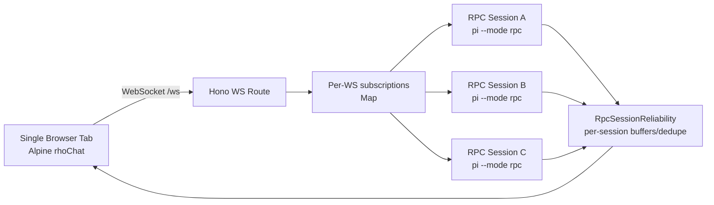

# Research: Current rho-web Multi-Session Readiness

## Scope

Audit current rho-web code to determine what already supports parallel sessions and what blocks a mobile-first multi-session UI.

## Method

- Local code inspection of:
  - `web/public/js/chat/index.js`
  - `web/public/js/chat/chat-rpc-event-routing.js`
  - `web/public/js/chat/chat-session-ui.js`
  - `web/public/js/chat/chat-session-actions.js`
  - `web/server-rpc-ws-routes.ts`
  - `web/server-core.ts`
  - `web/rpc-manager.ts`
  - `web/rpc-reliability.ts`
- Subagent attempt was run but returned only runtime warnings in this environment; findings below are from direct source inspection.

## Findings

### 1) Backend already supports multiple RPC sessions concurrently

What already works:

- `RPCManager` maintains a `Map<string, SessionState>` and can run many `pi --mode rpc` subprocesses simultaneously.
- `findSessionByFile(sessionFile)` reuses an existing RPC process for the same session file instead of always spawning a new one.
- WebSocket routing in `server-rpc-ws-routes.ts` supports per-command `sessionId` and `sessionFile`.
- `server-core.ts` tracks subscriptions per socket as `Map<WS, Map<sessionId, unsubscribe>>`, which allows one browser WebSocket to subscribe to multiple sessions.
- `RpcSessionReliability` is already session-scoped (event buffers, command dedupe, orphan timers).

Implication: server architecture is already close to multiplex-capable for one socket + many sessions.

### 2) Frontend is still fundamentally single-session

Evidence in state model (`chat/index.js`):

- Global singleton fields: `activeSessionId`, `activeRpcSessionId`, `activeRpcSessionFile`, `renderedMessages`, `isStreaming`, `isSendingPrompt`, `streamMessageId`, `promptText`, `pendingImages`, `sessionStats`, `lastRpcEventSeq`, `pendingRpcCommands`, etc.

Evidence in event routing (`chat-rpc-event-routing.js`):

- Incoming RPC events are dropped unless `payload.sessionId === this.activeRpcSessionId`.
- `session_started` always rewrites global active RPC fields.

Evidence in selection lifecycle (`chat-session-ui.js`):

- `selectSession()` and `clearSelectedSession()` reset global runtime state, clear pending maps, and switch the one active RPC target.

Evidence in websocket recovery (`chat-input-and-rpc-send.js`):

- reconnect logic recovers only one session (`activeRpcSessionId` + single `lastRpcEventSeq`).

Implication: primary blocker is frontend state/routing, not backend concurrency.

### 3) Optional backend additions could improve observability, but are not required for POC

Not required, but potentially useful:

- `GET /api/rpc/sessions` exposing `rpcManager.getActiveSessions()` for debug/status panel.
- Lightweight server event for session status snapshots.

POC can succeed without these by deriving status from per-session event streams client-side.

## Risk Assessment

- **High risk:** Refactoring chat frontend state without regressions in streaming/tool rendering.
- **Medium risk:** Correctly handling reconnect/replay per session (seq tracking per session, not global).
- **Low risk:** Backend process lifecycle scaling (already supported, no enforced cap required for v1 per requirements).

## Architecture Snapshot

## Conclusion

- Backend is ready for parallel sessions.
- Frontend needs a structural change from global single-session state to per-session state objects with session-keyed routing.

## Connections

- [[../idea-honing.md]]
- [[02-mobile-browser-runtime-constraints.md]]
- [[03-v1-mobile-first-ux-and-state-model.md]]
- [[04-poc-acceptance-matrix.md]]
- [[session-health-monitor-inspiration]]
- [[rho-dashboard-improvements-2026-02-14]]
