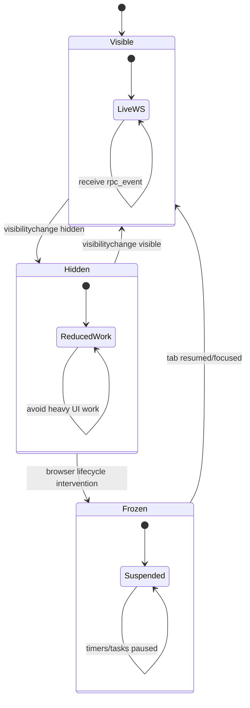

# Research: Mobile Browser Runtime Constraints for Multi-Session Chat

## Scope

Identify browser/runtime constraints that make “multiple browser tabs” a poor strategy on mobile and inform a single-tab multi-session design.

## External References

1. MDN Page Visibility API
   - https://developer.mozilla.org/en-US/docs/Web/API/Page_Visibility_API
2. Chrome Page Lifecycle API
   - https://developer.chrome.com/docs/web-platform/page-lifecycle-api
3. MDN Web Storage API (localStorage/sessionStorage sync behavior)
   - https://developer.mozilla.org/en-US/docs/Web/API/Web_Storage_API
4. MDN Storage quotas and eviction criteria
   - https://developer.mozilla.org/en-US/docs/Web/API/Storage_API/Storage_quotas_and_eviction_criteria

## Findings

### 1) Background tabs are constrained by browser lifecycle policies

- MDN explicitly notes hidden/background tabs have special policies to reduce resource usage.
- Chrome lifecycle docs confirm background pages may be **frozen** or **discarded** to conserve resources.

Implication for rho-web:

- Relying on separate browser tabs for parallel sessions is fragile on mobile.
- A single active tab with internal multi-session management is more reliable.

### 2) Visibility-driven adaptation is required

- Page Visibility gives a clean signal for visible/hidden transitions.

Implication for rho-web:

- Keep existing visibility-aware behavior (pause polling, reconnect WS on resume).
- For multi-session, maintain session metadata in-memory + restore from persisted state after resume/reload.

### 3) localStorage is acceptable for small restore metadata

- Web Storage is synchronous and should be used for small payloads.
- Quotas are sufficient for tiny metadata blobs (active IDs, focus, draft text), not full transcript data.

Implication for rho-web:

- Persist only compact session restore state:
  - active session IDs
  - focused session ID
  - draft text per session
- Do not persist full rendered messages in localStorage.

## Lifecycle Model

## Practical Design Constraints Derived

- Must not depend on continuous background execution for correctness.
- Must support fast resync (`/api/sessions/:id` + `get_state`) after visibility/reload transitions.
- Should keep background updates lightweight and milestone-based (matches v1 requirement: badges only, no toasts).

## Conclusion

Mobile constraints strongly support the chosen architecture: one tab, one WS, N sessions multiplexed internally, with compact persisted restore state.

## Connections

- [[../idea-honing.md]]
- [[01-current-rho-web-multi-session-readiness.md]]
- [[03-v1-mobile-first-ux-and-state-model.md]]
- [[04-poc-acceptance-matrix.md]]
- [[session-health-monitor-inspiration]]
- [[agent-observability]]
