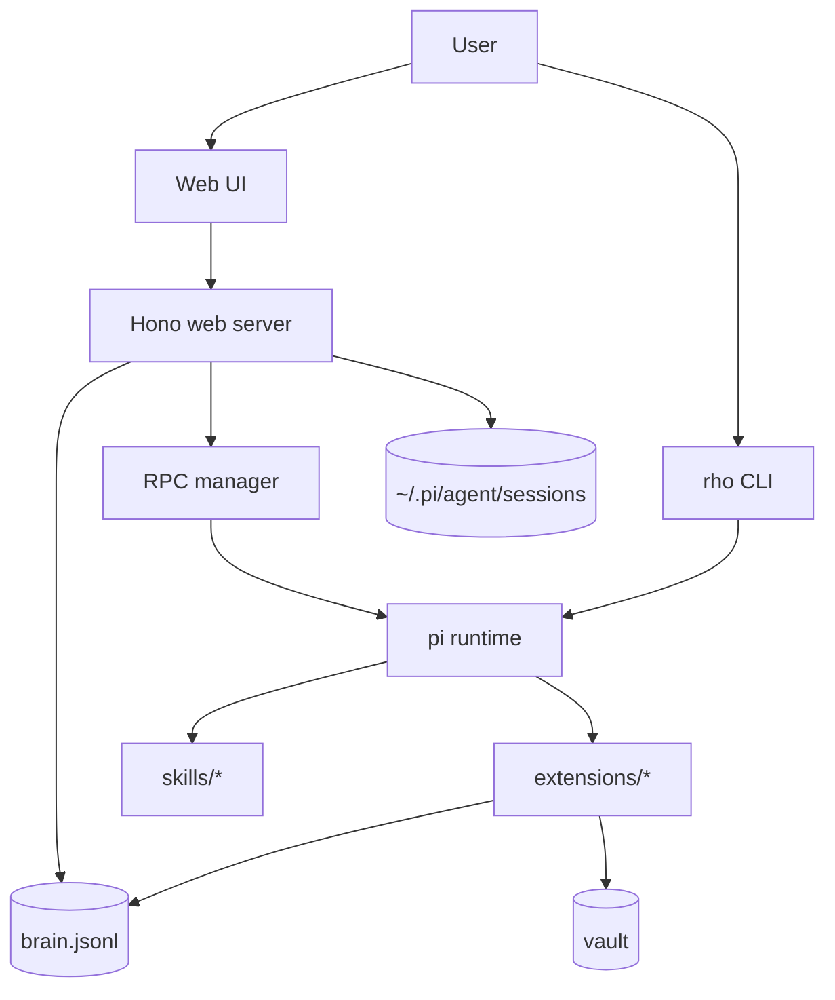

# Architecture

## System Overview
Rho is a pi package that combines:
1. CLI orchestration (`rho` command)
2. Always-on extensions (memory/heartbeat/vault/tool bridges)
3. Skill packs (SOP workflows)
4. Optional web UI (chat + memory/tasks/config + review)

## Layered View

## Web Architecture (post-refactor)
- `web/server.ts` composes route modules registered against shared `app` from `web/server-core.ts`
- Route modules are domain-scoped (`review`, `git`, `config/sessions`, `tasks/memory`, `rpc/ws`, `static`)
- Session parsing split into `session-reader-types|io|parse|api`
- Frontend chat is ES-module composed via `web/public/js/chat/index.js`

## Key Design Choices
- **No-build frontend delivery**: browser code remains JS modules; Node/server remains TS
- **Composable routes**: server logic split by API domain to stay under line constraints
- **Append-only memory model**: brain updates are journal entries/tombstones rather than in-place mutation
- **RPC bridge pattern**: web chat is transport + replay/reliability layer over pi session RPC

## Boundaries
- CLI handles install/sync/doctor/lifecycle
- Extensions implement runtime tools/behaviors
- Skills encode operator workflows
- Web layer provides observability + UX, not source of truth
