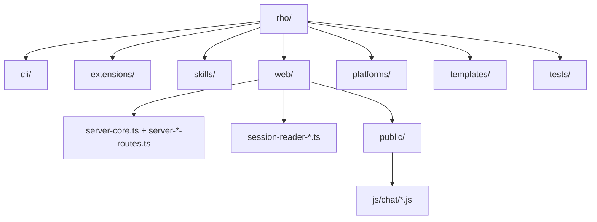

# Codebase Info

## Scope
- Repository: `rho`
- Analysis mode: full scan (no prior `.agents/summary/.last_commit` baseline found)
- Primary language: TypeScript (Node/runtime + extensions + CLI)
- Browser runtime language: JavaScript (no-build static modules under `web/public/js`)

## High-Level Stats
- Top-level domains: `cli`, `extensions`, `skills`, `web`, `platforms`, `templates`, `tests`, `docs`
- Core extension entrypoints: 9 (`extensions/*/index.ts`)
- Core skills in repo: 15 (`skills/*/SKILL.md`)
- Web backend modules: split route architecture under `web/server-*.ts`
- Web frontend chat modules: split ES modules under `web/public/js/chat/`

## Runtime Split (important)
- Node runtime: `web/*.ts`, `cli/**/*.ts`, `extensions/**/*.ts`
- Browser runtime: `web/public/js/**/*.js`
- Reason: browser assets are served directly (no frontend transpile/bundle step)

## Structural Map

## Notable Constraints
- Extension loader rule: one extension per folder (`extensions/<name>/index.ts`)
- Shared extension library must use `extensions/lib/mod.ts` (not `extensions/lib/index.ts`)
- Web code line guard: hard 500-line limit for `web/**/*.ts` and `web/**/*.js`
