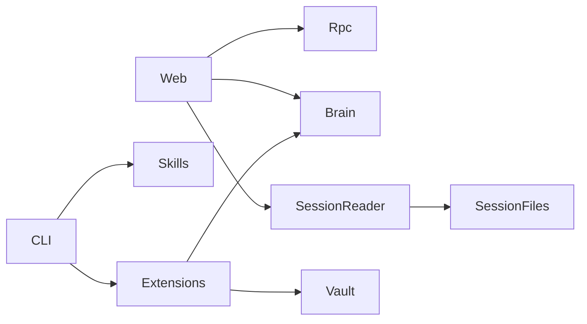

# Components

## CLI (`cli/`)
- Command entry + command modules (`init`, `sync`, `doctor`, `start`, `status`, `web`, `telegram`, etc.)
- Owns installation/bootstrap and module synchronization behavior
- Integrates templates (`templates/init.toml`, `templates/packages.toml`)

## Extensions (`extensions/`)
- `rho/`: heartbeat, memory, vault core behavior
- `memory-viewer/`: memory tool surface + UX helpers
- `vault-search/`: vault query tooling
- `telegram/`, `email/`, `brave-search/`, `x-search/`: external integration tools
- `usage-bars/`: UI/runtime usage telemetry affordance
- Shared support: `extensions/lib/mod.ts`

## Skills (`skills/`)
- Workflow/SOP packs (pdd, code-assist, eval, memory-consolidate, update-pi, etc.)
- Referenced by module registry and consumed by pi runtime

## Web Backend (`web/*.ts`)
- `server-core.ts`: app bootstrapping + shared server context
- `server-review-routes.ts`: deferred review APIs + review websocket
- `server-git-routes.ts`: git status/diff + review-from-git bootstrap
- `server-config-sessions-routes.ts`: init.toml + session listing/fork/new
- `server-tasks-memory-routes.ts`: tasks + memory CRUD APIs
- `server-rpc-ws-routes.ts`: chat RPC websocket bridge/replay/dedupe
- `server-static-routes.ts`: SPA + static asset serving/cache headers
- `session-reader-*.ts`: session file discovery, parsing, aggregation

## Web Frontend (`web/public/`)
- `index.html`: app shell (chat/memory/tasks/config/review)
- `js/chat/index.js`: chat Alpine registration/composition
- `js/chat/*.js`: transport, streaming, session UI/actions, slash/stats, model/extension dialog
- `js/memory.js`, `js/review-panel.js`, `js/pull-to-refresh.js`: focused UI modules

## Tests (`tests/`)
- Broad TS-based regression suite
- Web-specific reliability/smoke tests for reconnect/orphan/review/session usage
- Guardrail tests include web line-limit enforcement

## Component Dependency Sketch

