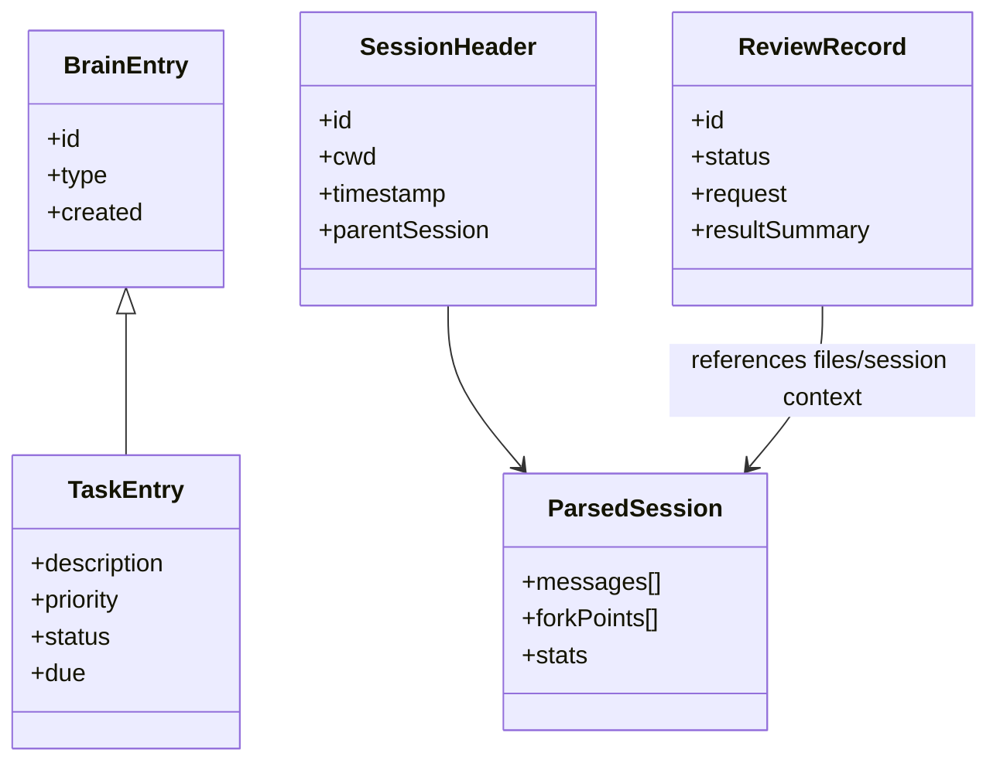

# Data Models

## Brain Entry Model (append-only)
Core entry families include:
- `behavior` (`do`/`dont`/`value`)
- `identity`
- `user`
- `learning`
- `preference`
- `context`
- `task`
- `reminder`
- `tombstone` (logical deletes)

Web memory APIs aggregate these into typed collections, then filter/search in-memory.

## Session Models
- Session header (`type: session`, `id`, `cwd`, `timestamp`, optional `parentSession`)
- Session entries (message, compaction, branch_summary, custom_message, labels)
- Parsed session output:
  - `messages[]`
  - `forkPoints[]`
  - `stats` (messageCount/tokenUsage/cost)

## Review Models
- Review session (in-memory + persisted record)
- Review submission lifecycle statuses:
  - `open` -> `submitted` -> `claimed` -> `resolved`
  - cancellation path supported
- Comment model: file path + line range + selected text + comment body

## RPC Reliability Models
- Event replay buffer per session (sequence numbers)
- Command dedupe cache keyed by command ID
- Orphan detection state (abort/stop timing window)

## Entity Relationship Sketch

