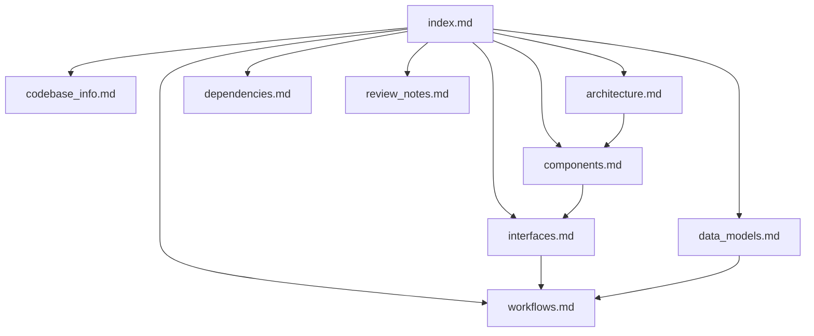

# Rho Documentation Index (AI-first)

Use this file as the **primary entrypoint** for codebase questions. It tells you where to drill down next.

## How to Use
1. Start with `codebase_info.md` for runtime/language boundaries.
2. For architecture questions, read `architecture.md` + `components.md`.
3. For API/integration questions, read `interfaces.md`.
4. For data shape and persistence questions, read `data_models.md`.
5. For behavior flows and debugging paths, read `workflows.md`.
6. Use `review_notes.md` for known risks/gaps.

## Document Map
| File | Purpose | When to read |
|---|---|---|
| `codebase_info.md` | Repo shape, language/runtime split, constraints | First pass orientation |
| `architecture.md` | Layered architecture and design decisions | "How is this system organized?" |
| `components.md` | Responsibilities per package/module | "Where should I change X?" |
| `interfaces.md` | CLI + HTTP + websocket interfaces | "What API/contract is used?" |
| `data_models.md` | Session/memory/review and reliability models | "What data structure is this?" |
| `workflows.md` | End-to-end operational flows | "What happens when user does X?" |
| `dependencies.md` | Runtime deps and external systems | "What library/service powers this?" |
| `review_notes.md` | Consistency/completeness checks + risks | "What might be stale or fragile?" |

## Knowledge Graph

## Typical Query Routing
- "Why TS + JS split in web?" → `codebase_info.md`, `architecture.md`
- "Where is websocket replay logic?" → `interfaces.md`, `components.md`
- "How does session forking work?" → `interfaces.md`, `workflows.md`
- "What can safely be refactored next?" → `review_notes.md`, `components.md`
