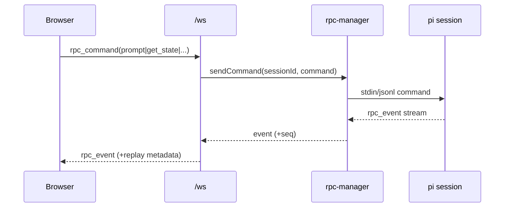

# Interfaces

## CLI Interface
- Executable: `rho` (`cli/rho.mjs`)
- Representative command groups:
  - lifecycle: `start`, `stop`, `status`, `trigger`
  - setup: `init`, `bootstrap`, `sync`, `upgrade`, `doctor`
  - web: `web`
  - integrations: `telegram`, `skills`, `config`, `logs`, `login`

## Web HTTP API
### Health / Review
- `GET /api/health`
- `GET|POST|DELETE /api/review/sessions...`
- `GET|POST /api/review/submissions...`
- `GET /review`, `GET /review/:id`, `GET /review/:id/api/*`
- `GET /review/:id/ws` (websocket upgrade)

### Git / Review bootstrap
- `GET /api/git/status`
- `GET /api/git/diff?file=...`
- `POST /api/review/from-git`

### Config / Sessions
- `GET|PUT /api/config`
- `GET /api/sessions`
- `GET /api/sessions/:id`
- `POST /api/sessions/:id/fork`
- `POST /api/sessions/new`

### Tasks / Memory
- `GET|POST|PATCH|DELETE /api/tasks...`
- `GET|POST|PUT|DELETE /api/memory...`

### RPC WebSocket
- `GET /ws` (websocket)
- Supports `rpc_command` envelopes, replay cursors, dedupe IDs, and ping/pong

## Extension Tool Interfaces
- Tool surfaces are exposed via pi extension index modules
- Common capability classes:
  - persistent memory (`brain`)
  - vault search/write
  - external channels (telegram/email/search)

## Interaction Sequence (chat message path)

