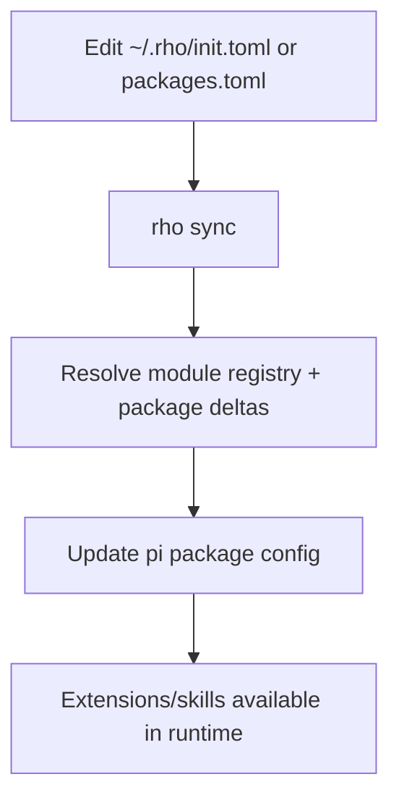
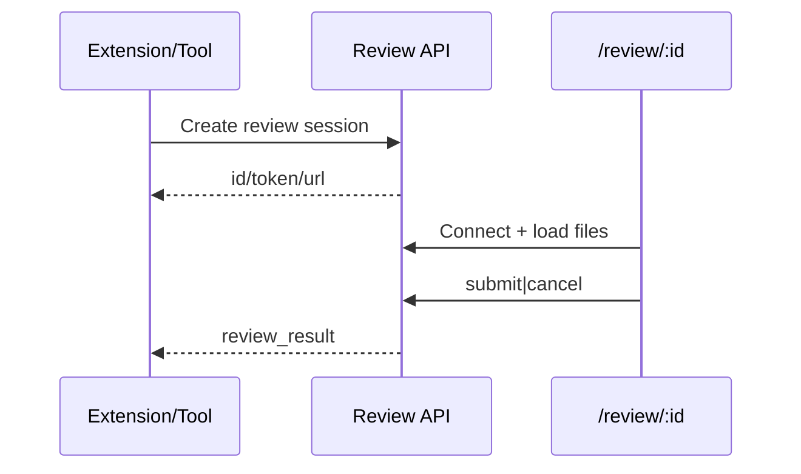

# Workflows

## 1) Install / Sync Workflow

## 2) Web Chat Workflow
1. Browser loads `index.html` and chat module entry (`web/public/js/chat.js`)
2. Chat opens `/ws` websocket
3. Prompt is sent as `rpc_command`
4. Server routes to rpc-manager session
5. Streaming events update UI incrementally (with replay/sequence handling)

## 3) Session Fork Workflow
1. User selects a prior user message
2. `POST /api/sessions/:id/fork` with `entryId`
3. Server uses `SessionManager.createBranchedSession(...)`
4. New session file returned + loaded in UI

## 4) Deferred Review Workflow

## 5) Memory CRUD Workflow (Web)
- Read aggregated brain state from append-only log
- Create/update/delete append new entries (or tombstones)
- Recompute folded view for subsequent reads

## Operational Notes
- Web workflow is polling + websocket hybrid; websocket handles live chat events
- Reliability mechanisms (replay, dedupe, orphan handling) are first-class and covered by regression tests
